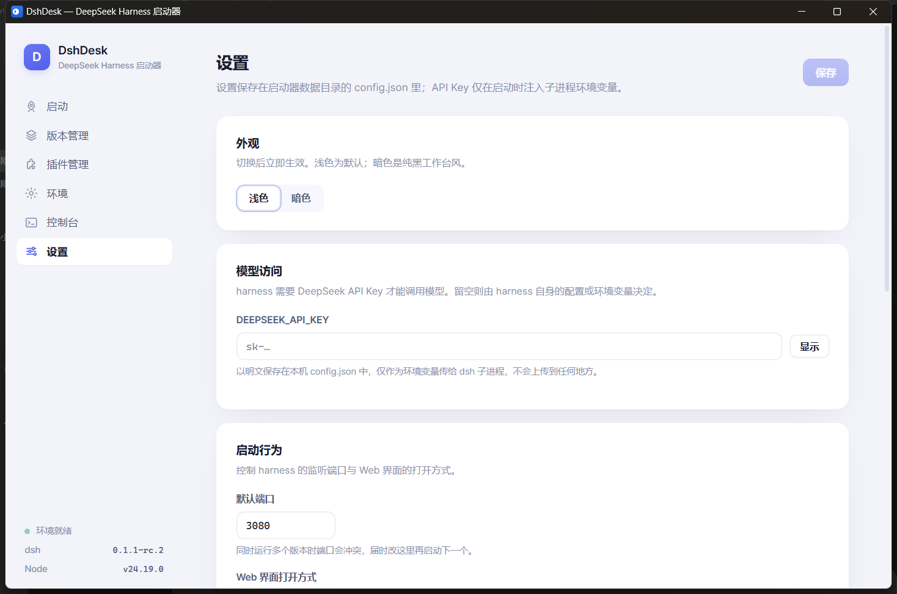

# DshDesk — DeepSeek Harness 启动器

DeepSeek Harness（`@deepseek-ai/dsh`）的第三方 Windows 桌面启动器，对标 Minecraft 的 PCL 启动器体验：**运行时托管、版本（profile）隔离、插件管理**，全部图形化操作，不碰命令行。



## 功能

| 模块 | 说明 |
|---|---|
| 🚀 启动 | 选择版本一键启动 `dsh web`，独立 WebUI 窗口（或系统浏览器），实时状态与运行时长 |
| 📦 版本管理 | 每个版本 = 一个 harness profile（`$DSH_HOME/profiles/<名>/`），独立插件集与配置层；支持新建 / 复制 / 重命名 / 删除 / 打开目录；dsh 本体版本安装、切换、回滚（含 rc 预览版） |
| 🧩 插件管理 | 按版本隔离安装/卸载插件，全部转发官方 `dsh plugin` 命令保证兼容；内置插件市场（npm `keywords:dsh-plugin` 检索，可追加第三方 catalog.json） |
| ⚙ 环境 | 启动器私有目录托管便携 Node.js（官方/npmmirror 镜像可选）+ dsh + pnpm，与系统环境完全隔离；一键修复重装 |
| 📜 控制台 | harness 进程、插件安装、环境安装的实时输出，按来源过滤、复制 |
| 🛠 设置 | DEEPSEEK_API_KEY（仅注入子进程环境变量）、端口、WebUI 打开方式、下载镜像、亮/暗主题 |

## 界面主题

- **浅色**（默认）：淡紫灰底 + 白色卡片 + 靛紫主强调 + 青绿点缀
- **暗色**：纯黑海拔阶梯，不掺紫，蓝色强调
- 设置页「外观」一键切换，即时生效并持久化

## 数据目录

```
%LOCALAPPDATA%\DshDesk\
├── config.json          # 启动器设置
├── runtime\node\        # 托管的便携 Node.js
├── runtime\dsh\         # 托管的 dsh / pnpm（npm 全局前缀）
└── home\profiles\       # DSH_HOME：每个版本一个目录
```

可用环境变量 `DSHDESK_DATA_DIR` 覆盖数据目录位置。

## 开发

```bash
npm install
npm run tauri dev      # 开发模式（需要 Rust 工具链）
npm run tauri build    # 产出 NSIS 安装包（src-tauri/target/release/bundle/）
```

技术栈：Tauri 2 + React 18 + TypeScript + Vite；Rust 负责进程管理（`taskkill /T /F` 杀进程树）、环境安装、CLI 转发。

## 说明

- DeepSeek Harness 处于开发者预览期（`0.1.x-rc`），CLI 与配置格式可能演进；启动器把所有 `dsh` 调用集中在 `src-tauri/src/dsh.rs` 一处，便于跟进。
- 本项目与 DeepSeek 官方无关，harness 本体为 MIT 开源（github.com/deepseek-ai/deepseek-harness）。
