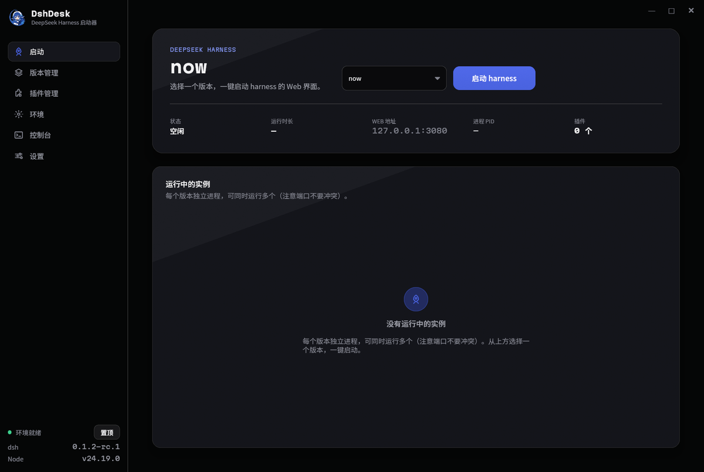
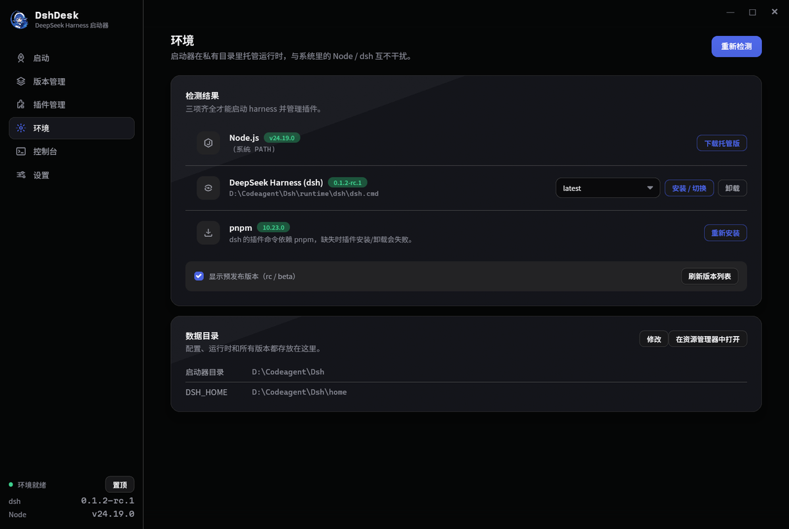
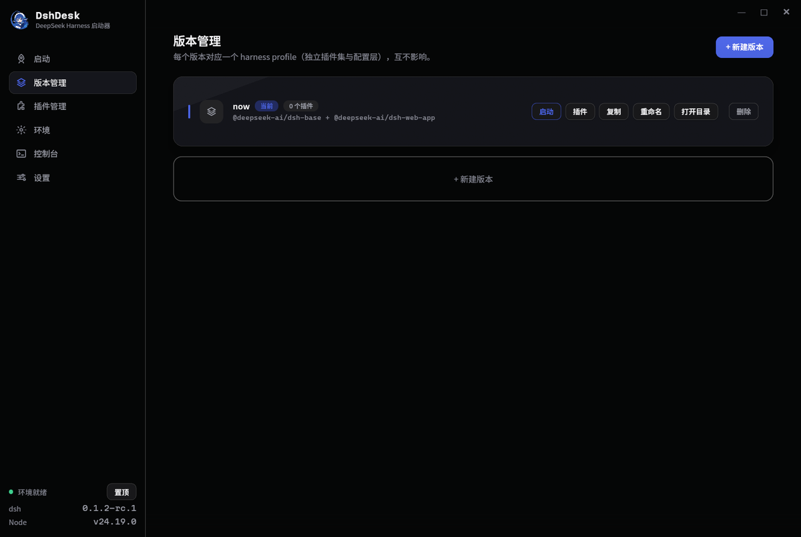
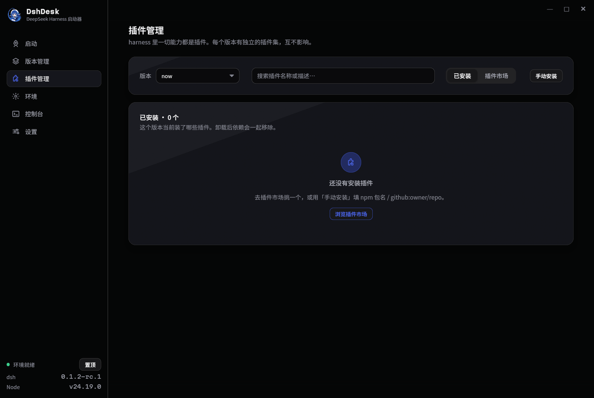
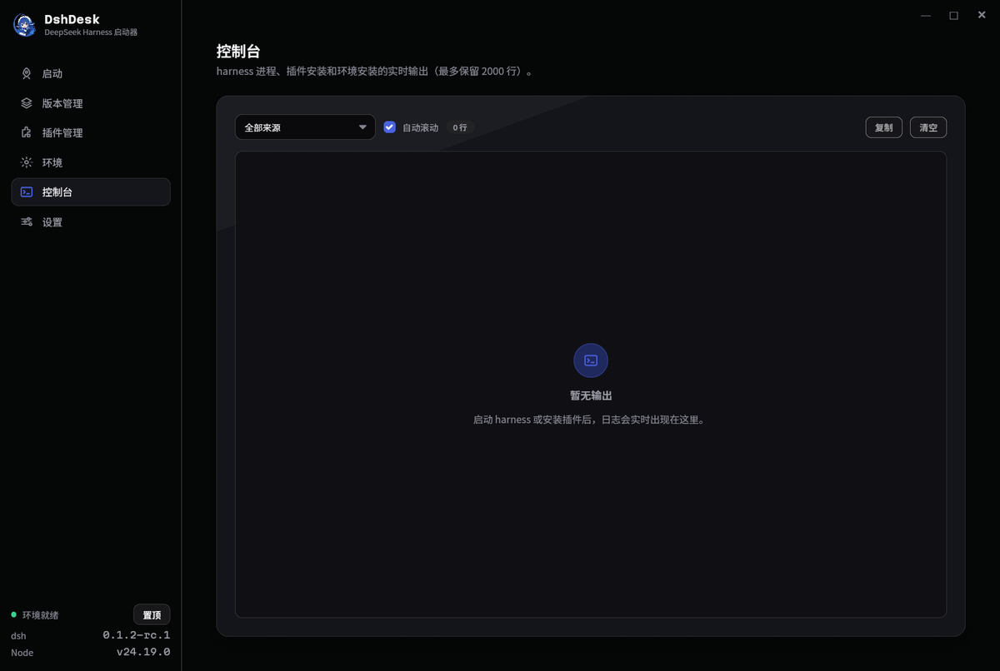
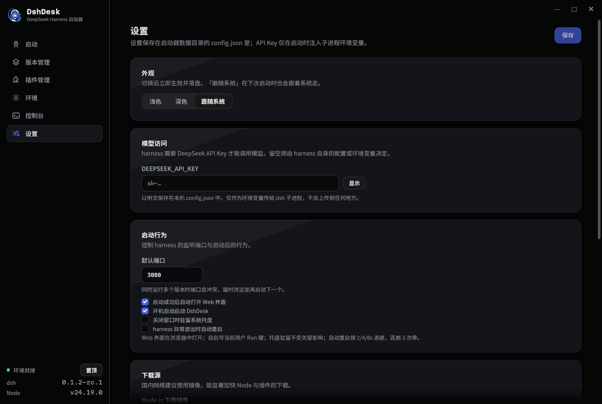

# DshDesk Native (Dshnext)

DeepSeek Harness（dsh）的 Windows 启动器 —— **纯 Rust 原生重写**（iced 0.14 + wgpu，界面无 WebView、无浏览器内核；仅「桌面窗口」模式按需调系统 WebView2，不打包内核）。

管理 dsh 的安装与版本切换、多 profile（配置/插件互相隔离）、环境托管（便携 Node.js / pnpm），带系统托盘、开机自启、崩溃自愈、目录迁移。单 exe 零运行时依赖，空闲时 CPU/GPU/出帧全部归零。

| 启动 | 环境托管 |
|---|---|
|  |  |

| 版本（profile）管理 | 插件管理 |
|---|---|
|  |  |

| 控制台 | 设置 |
|---|---|
|  |  |

## 功能

- **版本/profile 管理** —— 每个 profile 一套 cordis 配置 + 插件清单（`package.json`），互不干扰；新建/重命名/复制/删除；启动/停止/崩溃自动重启（指数退避）。共享一个 pnpm 依赖仓库，同插件多 profile 只存一份。
- **插件** —— 市场（npm `keywords:dsh-plugin` 检索）+ 手动安装（npm 包名或 `github:owner/repo`），装进 profile 隔离，不动官方 bundle。
- **WebUI 两种打开方式** —— 系统浏览器标签页，或「桌面窗口」：用系统 **WebView2** 开一个独立窗口（自己的图标、自己的标题栏、任务栏/MyDockFinder 里不再跟浏览器混在一起）。启动页可切。WebView2 运行时 Win10/11 自带，**不打包内核**；缺运行时则提示安装、不静默回退。
- **环境托管** —— 便携 Node.js / dsh / pnpm 装进私有 runtime 目录，与系统全局互不污染；版本列表拉取、一键安装/切换/卸载；**离线部署**：把安装包放进 `数据目录/offline/` 即可断网安装。
- **数据目录可迁移** —— 首次启动引导 + 随时在环境页改；迁移是两阶段的（先全量复制后删源，单文件 3 次退避重试），失败原地可重试，进度条实时显示。NTFS junction 正确重建。
- **系统托盘** —— 关闭到托盘常驻；开机自启（HKCU Run 键，免管理员）。
- **目录表单** —— 启动器数据目录与 `DSH_HOME` 可分别设置；实例运行中会先弹「停止并继续」确认框（防止换到一半吃到半新半旧的模块），确认后自动停完实例接着办。
- **单实例** —— 重复启动会把已有窗口前置然后退出（自动化旗标 `--shot` 等不受限）。
- **自更新** —— 内置 GitHub Releases 更新源；设置页一键检查，版本比对 + SHA-256 校验（发布时附 `.sha256` 即启用）+ 运行中替换。启动器与桌面窗口宿主两个 exe 一起换（Release 资产：`dshnext.exe` + `DeepseekHarness.exe`，各自可附 `.sha256`）。
- **诊断导出** —— 一键导出脱敏诊断文件（自动剔除 API Key）。
- **细节** —— 深浅双主题（可跟随系统）、切页入场动画、Ctrl+1..6 快捷切页、无边框自绘标题栏（拖动/缩放/双击最大化）、窗口几何记忆。

### 性能（本机 RTX 4060 / 14 核 / Win11 实测）

| 指标 | WebView2 上一代 | Dshnext |
|---|---|---|
| 空闲 CPU（全核） | 0.26% | **0.0015%** |
| 空闲 GPU | 1.72% | **0.00%（零出帧）** |
| 常驻内存（私有工作集） | 199 MB（7 进程） | **88.5 MB（单进程）** |
| 分发 | 需系统 WebView2 | **单 exe，零运行时依赖** |

空闲零出帧是靠「零订阅」纪律保证的：动画期间才挂帧订阅、有实例才挂轮询，其余时刻事件驱动画到不动为止（探针脚本在 `phase0/`，可复现）。

「桌面窗口」模式（WebView2）另计：它渲染 dsh 网页，进程树 ~150-200MB 记在 WebView2 名下，启动器本体仍维持上表的单进程数字；这是「要网页 UI 又要独立窗口」的固有代价，不想用就切回浏览器标签。

## 安装

从 [Releases](https://github.com/Kitup666/dsh-dshnext-launcher/releases) 下载 `Dshnext_0.1.12_x64-setup.exe`（每用户安装，免管理员，带开始菜单项与卸载器）；或直接下绿色版 `dshnext.exe` + `DeepseekHarness.exe`（两个放同一目录）拷走即用。

系统要求：Windows 10/11 x64。**无需**安装 Node.js、WebView2 或任何运行时。

## 使用注意

- **DeepSeek API Key** 只保存在本机 `config.json`，仅作为环境变量传给 dsh 子进程，**不会上传到任何地方**（设置页可一键导出脱敏诊断）。
- **多 profile 共享一个端口**（默认 3080）：同一时间只跑一个 profile；换端口可以并行，但 harness 级共享文件（settings.yaml、storages）会互相覆盖，不建议。
- **实例运行中**时安装/卸载 dsh、Node、pnpm 会弹「停止并继续」确认——这是保护：runtime 文件正被使用，边跑边换会坏。装/卸插件不需要停（dsh 支持热载）。
- **数据目录迁移**时请先停止所有实例；迁移过程中断电/强杀也安全（两阶段设计，旧位置在新位置完整前不动）。
- 卸载启动器不会动你的数据目录（profile、会话、凭据都在），重装即恢复。
- 无边框窗口：标题区拖动、边缘 6px 缩放热区、双击标题区最大化；`Ctrl+1..6` 切页。
- **已知限制**：暂无屏幕阅读器支持（iced 0.14 尚无 AccessKit 集成）；T 主题快捷键仅开发构建。

## 从源码构建

```bash
cargo build --release --workspace  # dshnext.exe（22 MB）+ 桌面窗口宿主 DeepseekHarness.exe（~1.9 MB），均零依赖
cargo test                         # 36 例（iced_test headless + 纯函数）
cargo run --release -- --page env --shot out.png --after 4000   # 自截图
```

桌面窗口（「打开界面」的独立窗口模式）是独立二进制 `DeepseekHarness.exe`：自带鲸鱼图标与程序名（dock/任务栏/任务管理器独立成行），也可**双击独立打开**——读启动器最近一次落盘的 WebUI 地址（`webui-url.txt`，含 token，在用户级数据目录）。绿色版使用时两个 exe 需放同一目录。

Rust 1.92+（edition 2024）。构建产物静态链 CRT（`+crt-static` 已固化在 `.cargo/config.toml`），`dumpbin /DEPENDENTS` 只剩系统 DLL。

NSIS 安装包：`makensis packaging/installer.nsi` → `packaging/Dshnext_0.1.12_x64-setup.exe`（装/卸全流程实测：包内 exe 与构建产物 SHA-256 一致，卸载后目录/开始菜单/注册表三处全净）。

## 文档

- [DESIGN.md](DESIGN.md) —— 设计决策与阶段日志（含与上一代的完整取舍清单）
- [docs/architecture/current-state.md](docs/architecture/current-state.md) —— 现状架构快照
- [AGENTS.md](AGENTS.md) —— 开发/自动化踩坑纪律

## License

MIT
